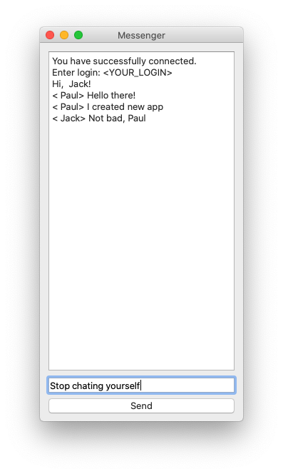

# Python Messenger
Created messenger on SkillBox online-webinar

# Repository structure
- **app** - chat project
- **day_1** - Python basics
- **day_2** - OOP
- **examples** - additional Python examples
- **resources** - webinar materials

# Webinar structure
**DAY 01 - Python Basics**
- [SkillBox](https://live.skillbox.ru/code_int/online/060520) - [YouTube](https://youtu.be/Q4R9OL_xskM)

**DAY 02 - Networking (TCP)**
- [SkillBox](https://live.skillbox.ru/code_int/online/070520) - [YouTube](https://youtu.be/50CKbJwwcT0)

**DAY 03 - Messenger Interface (PyQT)**
- [SkillBox](https://live.skillbox.ru/code_int/online/080520) - [YouTube](https://youtu.be/Ev4xtfhY3h0)

- [Telegram chat](https://t.me/joinchat/Di59WVhwp-01_Os28UFVPQ)
- [Speaker repository](https://github.com/manchenkoff/skillbox-async-messenger)
